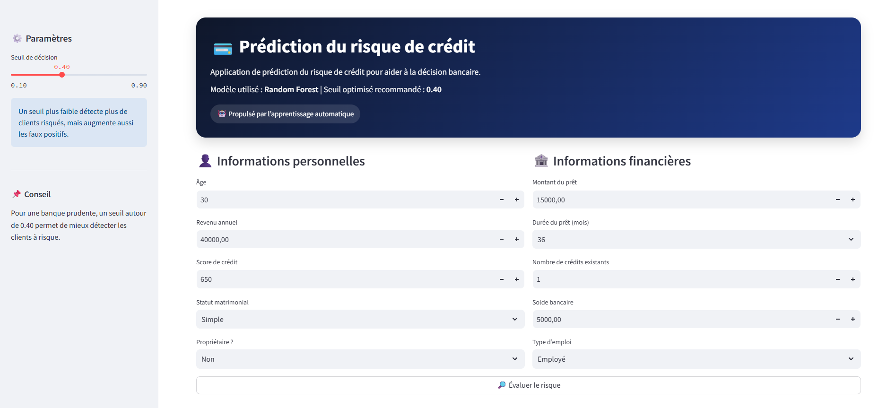
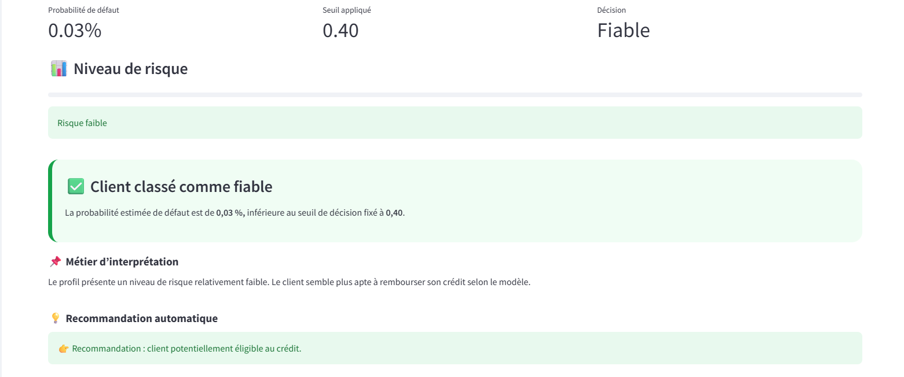
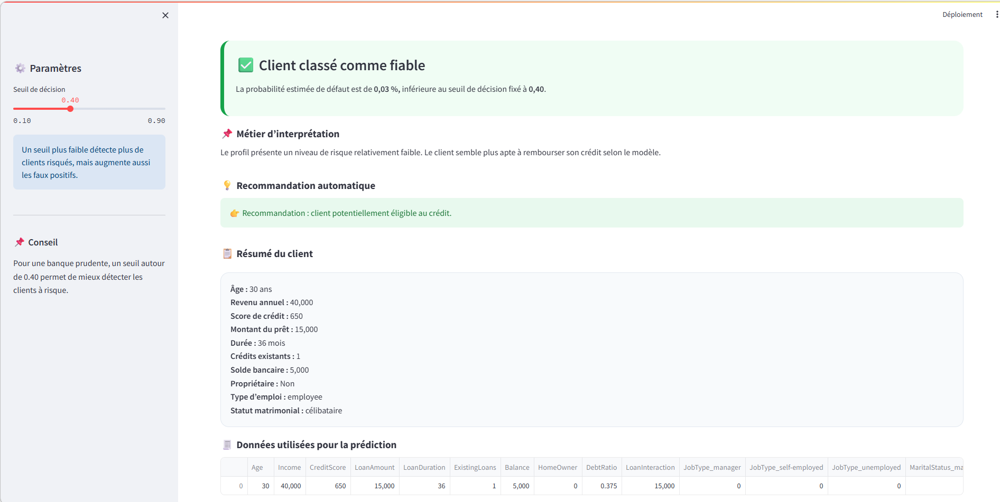

# 💳 Credit Risk Prediction App

##  Description

Ce projet de Data Science vise à prédire le risque de défaut de paiement d’un client bancaire à partir de ses informations financières et personnelles.

L’objectif est d’aider les institutions financières à prendre des décisions éclairées lors de l’octroi de crédits en intégrant à la fois la performance du modèle et l’impact métier.

---

## 🎯 Objectifs du projet

- Réaliser une analyse exploratoire des données (EDA)
- Construire plusieurs modèles de Machine Learning
- Comparer leurs performances
- Optimiser le seuil de décision
- Intégrer une logique métier (réduction des pertes)
- Déployer une application interactive avec Streamlit

---

## 📊 Dataset

Dataset simulé représentant des clients bancaires avec les variables suivantes :

- Age  
- Income (revenu annuel)  
- CreditScore  
- LoanAmount  
- LoanDuration  
- ExistingLoans  
- Balance  
- JobType  
- MaritalStatus  
- HomeOwner  
- Default (variable cible)  

---

## ⚙️ Feature Engineering

Création de nouvelles variables :

- **DebtRatio** = LoanAmount / Income  
- **LoanInteraction** = LoanAmount × ExistingLoans  

---

##  Modèles utilisés

- Logistic Regression  
- Random Forest  (modèle retenu)  
- MLP (réseau de neurones)  

---

##  Résultats

- Accuracy ≈ 0.98 – 0.99  
- ROC-AUC ≈ 0.99  
- Excellente capacité de classification  

👉 Le modèle Random Forest a été retenu pour sa robustesse et sa performance.

---

##  Optimisation du seuil (IMPORTANT)

Par défaut, le seuil de décision est 0.5.  
Nous avons testé plusieurs seuils :

| Seuil | Faux négatifs (risque) | Faux positifs |
|------:|------------------------:|--------------:|
| 0.3   | 0                       | 19            |
| 0.4   | 2                       | 19            |
| 0.5   | 7                       | 17            |
| 0.6   | 12                      | 10            |

### 🎯 Conclusion métier

- Faux négatif = perte financière   
- Faux positif = opportunité manquée  

Le seuil **0.4** représente le meilleur compromis :

- minimise les pertes
- maintient un bon équilibre

---

## 🌐 Application Streamlit

L’application permet :

- d’entrer les données d’un client  
- de prédire le risque  
- d’ajuster le seuil de décision  
- d’obtenir :
  - la probabilité de défaut  
  - une classification (fiable / risqué)  
  - une interprétation métier  
  - une recommandation automatique  

---

##  Aperçu de l’application

### Interface principale



### Résultat de prédiction





---

##  Structure du projet

```text
credit-risk-prediction/
├── app/                  # Application Streamlit
├── data/                 # Données
├── models/               # Modèles sauvegardés
├── notebooks/            # Analyse exploratoire
├── reports/figures/      # Graphiques et images
├── src/                  # Code Python
├── .gitignore
├── README.md
└── requirements.txt

